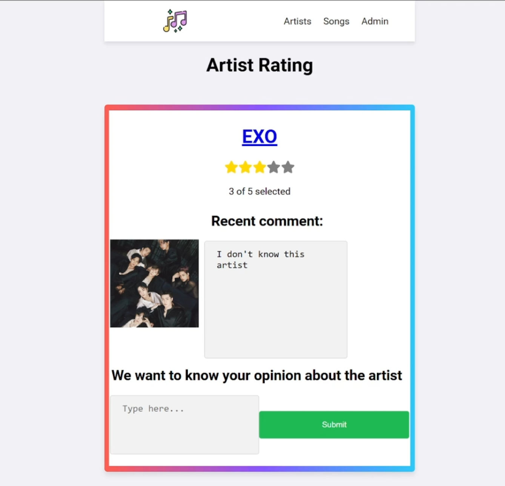
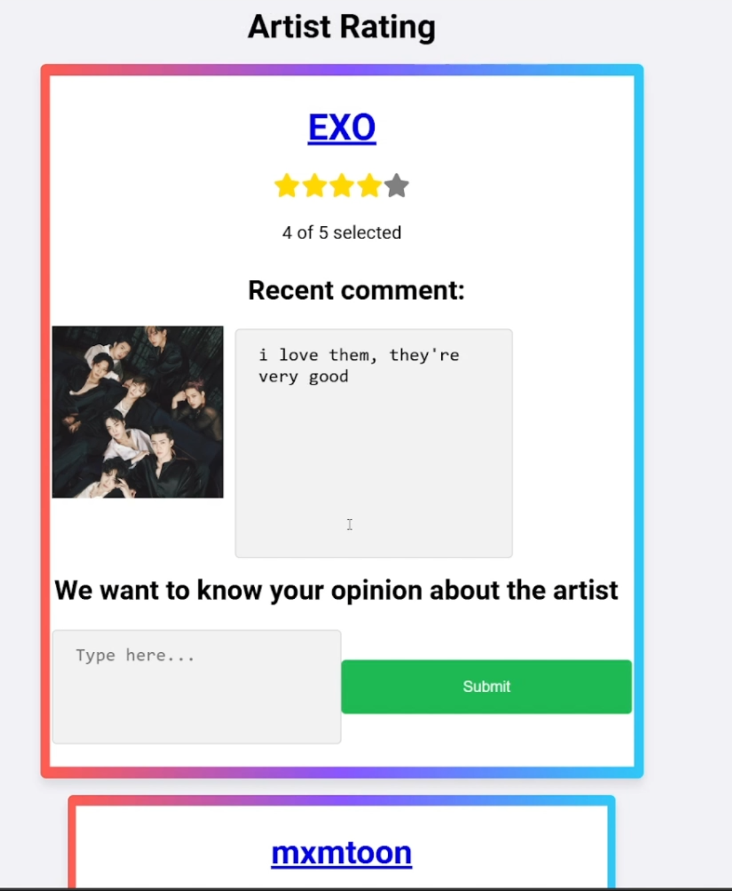
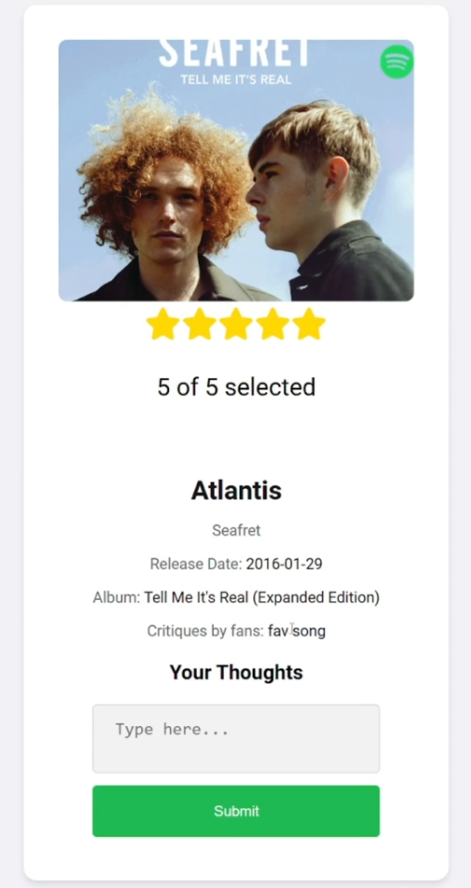
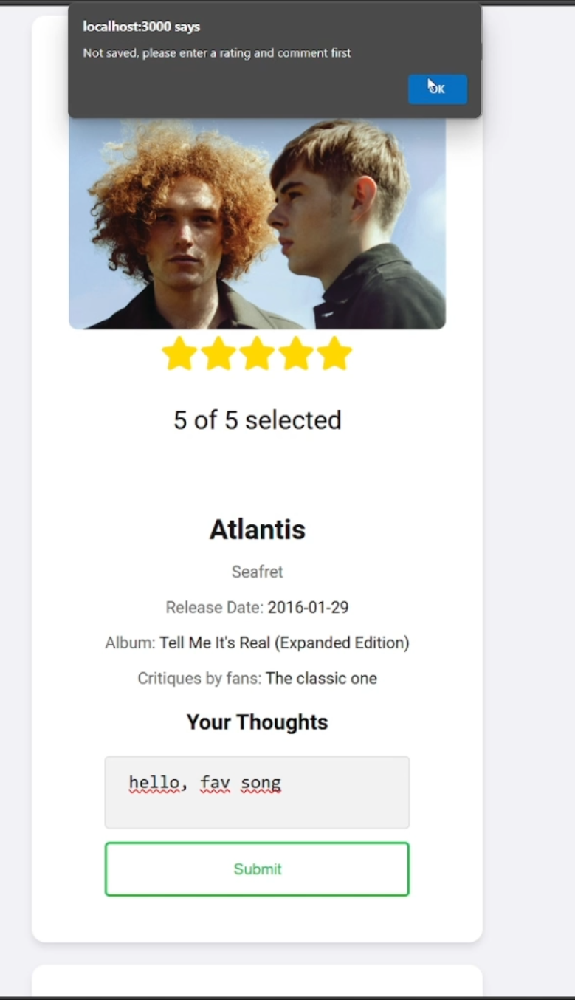
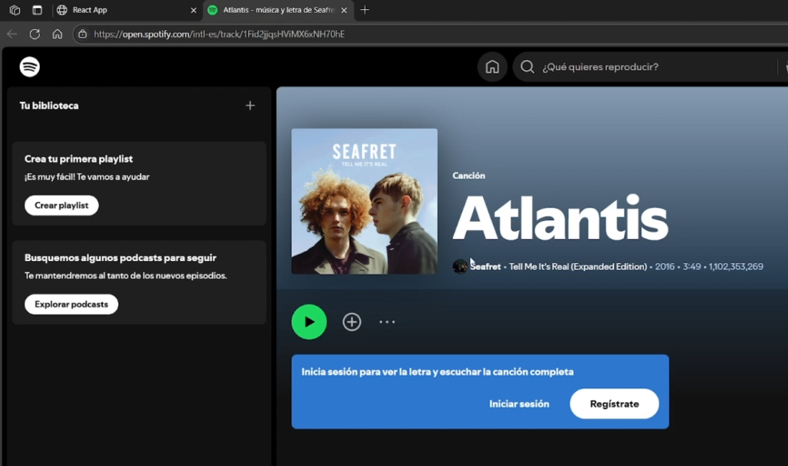
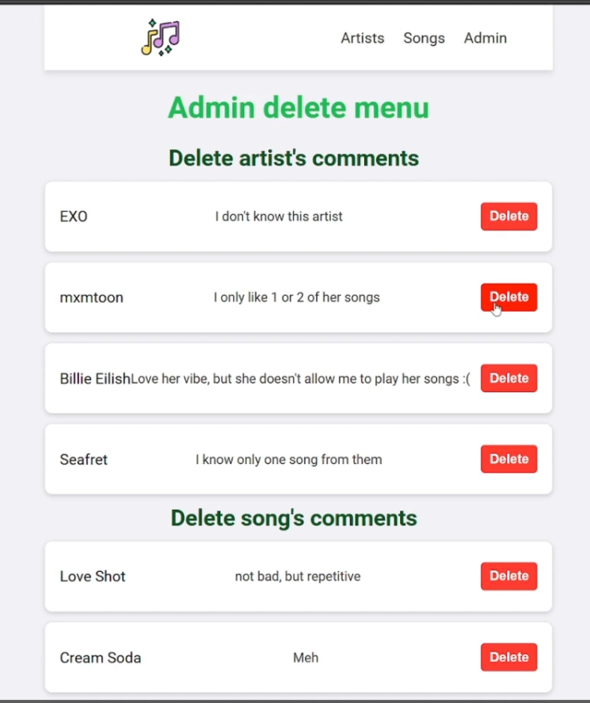

# 🎵 Artist Rating – Music Critique Web App

Welcome to **Artist Rating**, a music review platform where users can explore artists, rate songs, and leave critiques—with a sparkle of style (thanks to our dynamic star rating system ✨). Whether you're jamming to pop or dissecting jazz solos, this app is your stage.

> *"Everyone's a critic—Artist Rating just makes it prettier."*


## Project Overview

**Artist Rating** is a modern single-page application (SPA) built with **React**, featuring:

* Artist and song listings via a local API
* Interactive star-based rating system ⭐⭐⭐⭐⭐
* User-submitted comments on songs and artists
* Admin panel for moderating critiques
* Integration with the **Spotify Web API** for real-time data
* Lightweight testing and scalable structure


## Tech Stack

| Area            | Tool/Tech              | Purpose                                          |
| --------------- | ---------------------- | ------------------------------------------------ |
| Frontend        | React + React Router   | UI, navigation                                   |
| API Requests    | fetch API              | Data fetching                                    |
| Styling         | Custom CSS             | Component styling (check out the hover effects!) |
| Backend (local) | Express (assumed)      | Serving artist/song/comment data                 |
| External API    | Spotify Web API        | Real-world artist/song info                      |
| Testing         | @testing-library/react | Basic component testing                          |
| Utilities       | `createArray.js`       | Generate arrays for stars                        |


## How It Works

* **Home (`/`)** – Loads all artists from the API.
* **Songs (`/songs`)** – Displays songs by the selected artist, allowing users to leave ratings and comments.
* **Admin (`/admin`)** – Lets admins view and delete comments.

React's `useEffect`, state management, and props keep everything clean, modular, and efficient. Comments and ratings are synced via API calls to your backend and/or Spotify integration.


## Features

* ✅ View artists and songs
* ✅ Leave comments and star ratings
* ✅ Admin panel to moderate content
* ✅ Responsive UI with smooth hover effects
* ⚠️ Basic testing in place 

## Demo
* **Home page** 

Shows all the artists that I selected

* **Rate update & animation** 

Demonstrates rating feature

* **Song rating** 

Shows songs rating's design

* **Rating verification** 

You must assign a star and comment rating before proceeding

* **Redirecting to Spotify** 
             
Spotify's icon in top right corner redirects you to listen the selected song in Spotify

* **Moderator's page** 

Also known as admin's page, here moderators can delete any inappropiate ratings.


## 🛠 Notable Files

```bash
/src
 ├── App.js                 # Root component and routing logic
 ├── /components            # Reusable components
 │    ├── artistList.jsx
 │    ├── song.jsx
 │    ├── star.jsx
 │    ├── starRating.jsx
 │    └── adminDelete.jsx
 ├── /services              # JSON data + utilities
 │    ├── artist-info.json
 │    ├── songs-info.json
 │    └── createArray.js    # ⭐ Generates an array for star rating
 └── /tests
      └── songTest.test.js  # Our humble start to testing
```


### Strengths

* Modular, clean React architecture
* Real-world integration with Spotify
* Flexible and reusable components (like StarRating)
* Thoughtful visual UI (hover scale effects)


## Want to Contribute?

Fork the repo, open a pull request, or file an issue. Whether you’ve got a new feature in mind or found a pesky bug—jump in! 🎧


## Installation

```bash
git clone https://github.com/your-username/artist-rating.git
cd artist-rating
npm install
npm start
```

Make sure your local backend (on `localhost:5000`) is running and, if needed, is connected to the Spotify API with proper authentication.


## In summary

**Artist Rating** combines interactive UI with real music data to create a full-stack app that’s both useful and fun. It’s an ideal playground for learning React, practicing API integration, and getting my hands dirty with real-world architecture.

> *“Built with React. Powered by Spotify. Rated by music lovers.”*


